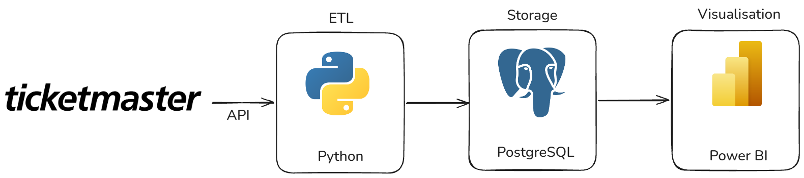
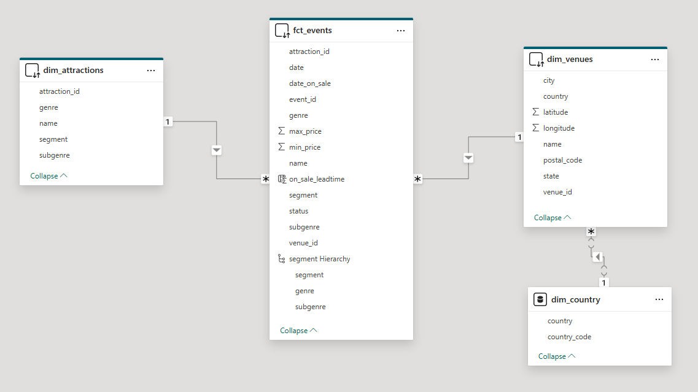
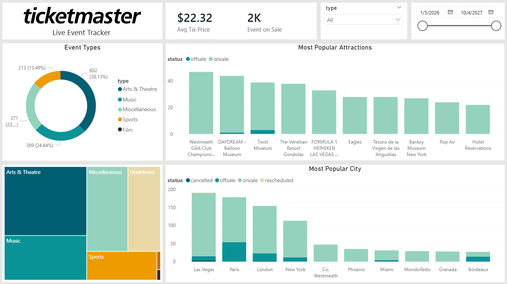
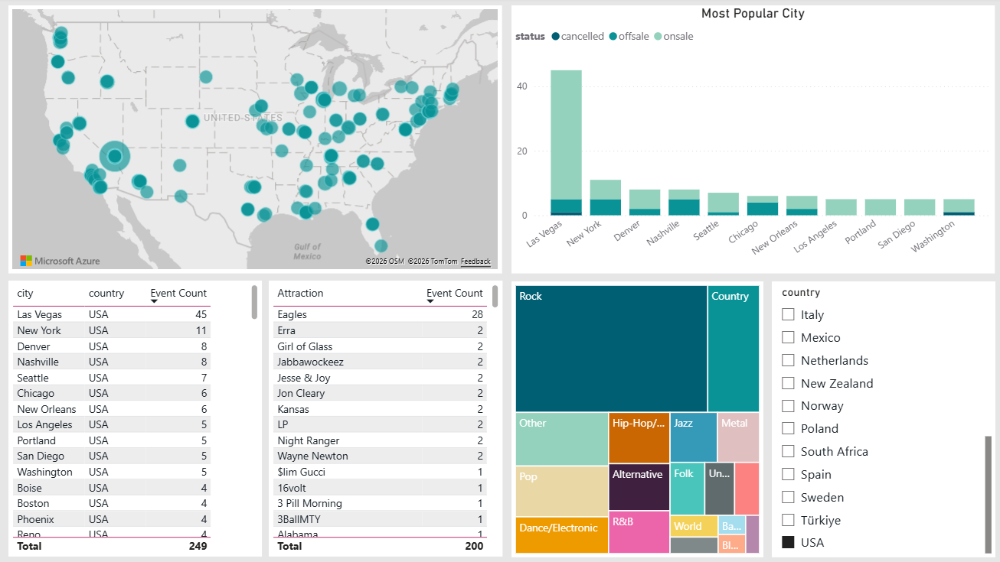
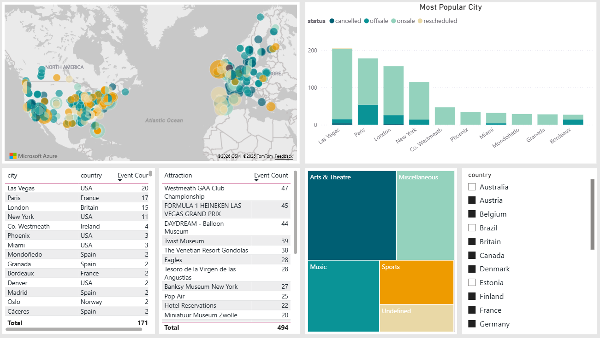
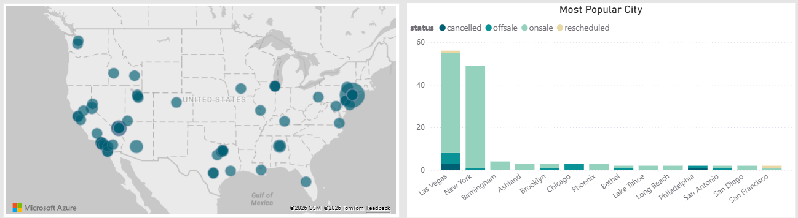
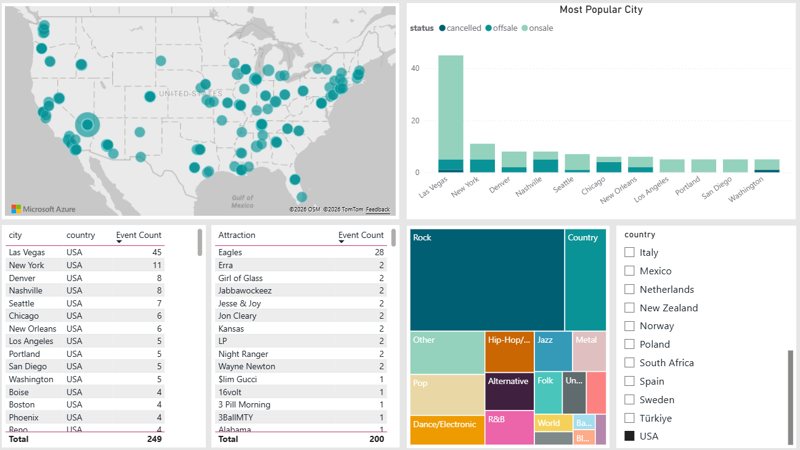
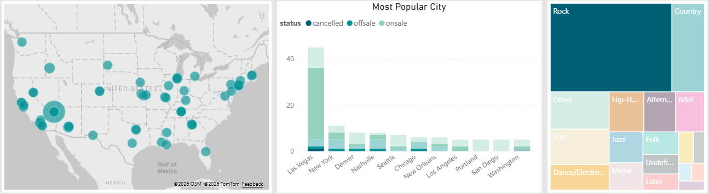
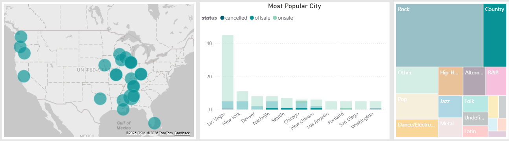

# Ticketmaster Live Event Tracker

Live Event Tracket with data taken from Ticketmaster API. 

Data is pulled using python code and saved into PostgreSQL DB. 

## Objective

As a Data Analyst, I want to build a dashboard that will assist event organizer to make decision on venue selection suitable with the event genre/types. Event organizers may view the most popular venues and use the dashboard to get the overall events coverage up to subgenre levels.

## Dataset

The data used in this project is obtained through Ticketmaster API endpoint which includes fields event dates, ticket prices, event types/genres, attraction details, and venue information.

- API endpoint: https://app.ticketmaster.com/discovery/v2/events
- API documentation: https://developer.ticketmaster.com/products-and-docs/apis/discovery-api/v2/#event-details-v2


## Technologies

The following technologies are used to build this project:
- Language: Python, SQL
- Storage: PostgreSQL
- Visualisation: Power BI

## Data Pipeline


Files in the following stages:
- Step 1: Fetch Data - [Fetch API](main.py#L23-L33)
- Step 2: Cleaning and transformation - [ETL](main.py#L35-L122)
- Step 3: Storage - [Create Table](db\init.py), [Load Data](main.py#L124)
- Step 4: Visualisation - [Dashboard](app\dashboard.pbix)

## Data Modeling

The datasets are designed using the principles of fact and dim data concepts. Three main tables are used: `fct_events` is the fact table, while `dim_attractions` and `dim_venues` are the dimension tables. 



## Data Visualisation

The dashboards were designed to serve as event coverage for different event types and genres. The first page serves as an overview for the top attractions and top cities with the highest events. Date and event types filters are also available to ease user experience in filtering the data accordingly.



A detailed visualisations are added in the second page. A map with bubble markers is added to give a better sense geographically to the events distribution. A treemap with the event types with hierarchy up to sub-genres is added for further filtering capabilities. The city and attraction tables provides more clarity on the event count details.



## Observations

As overview, most of the data gathered showing the events only in the western countries. This could be due to the bias of data from the Ticketmaster platform which could be targeted mainly for users in the part of the world. 

For a more fair analysis, I am focusing on the USA and Europe countries going forward.



Surprisingly, Arts & Theatre dominates the events coverage in term of the event types. With Paris coming first in term of event counts, and several more European cities in the top 10 highest events, we can safely say there is a lot demands and interests in the entertaiment categories. 



Las Vegas and New York are the only American cities in the Top 10 list for Arts & Theatre events, which are not surprising given the nature of Las Vegas city being the house of entertainment and the Broadway theatre scenes in New York. 



Looking at Music events, Rock dominates the scenes in USA, followed by Country. Rock events are happening all around the United States, but Country music events are mainly distributed in the central and southern regions. 





## Insights & Suggestions

We suggest the following actions for future event organizers to take note:

1. Arts & Theater events should cover the neighboring cities such as Philidelphia and San Francisco to spread out the interest while potentially offering lower price packages, compared to New York and Las Vegas. Los Angeles and Toronto could also be the next destination given that these locations are thriving for the film industry. 

2. Expand the Country music events to East Coast regions. While we do understand the genre is more popular in the Southern and Central regions, East Coast could offer new audiences since it is currently quite an underserved market to explore.

## Project Setup

Connect to a PostgreSQL DB and save the necessary info in an `.env` file.

```bash
DB_HOST=<db-host>
DB_PORT=<port>
DB_USER=<username>
DB_PASSWORD=<password>
DB_NAME=<db-name>
```

Initialise table creation in DB.

```bash
python db\init.py
```

Setup a developer account in [Ticketmaster](https://developer.ticketmaster.com/explore/)  and generate an API key. Paste the key into the `.env` file.

```bash
TIX_MASTER_API_KEY=<api-key>
```

Run the code to get data.

```bash
python main.py
```
